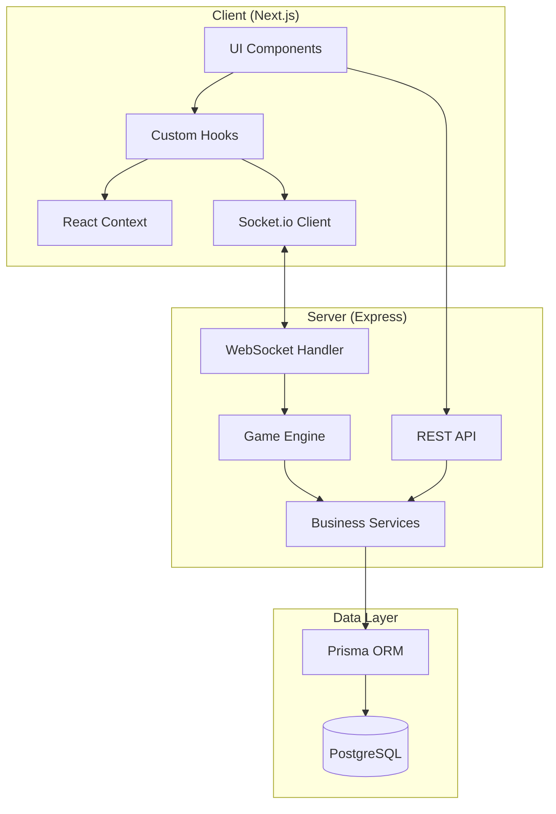
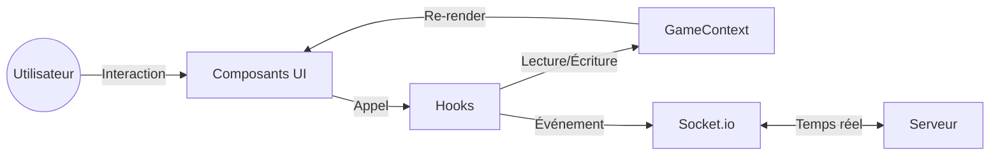
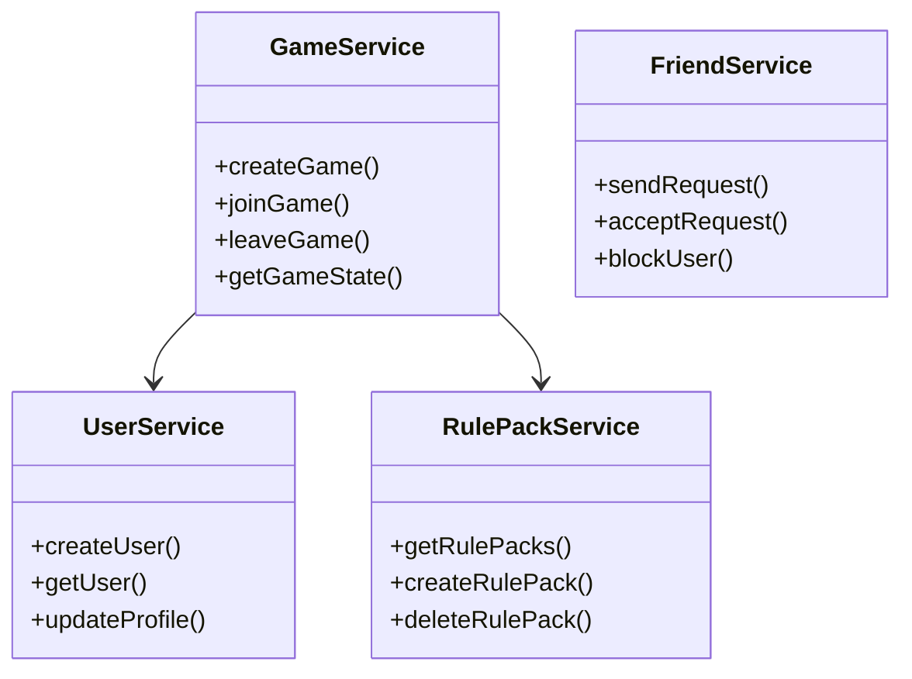
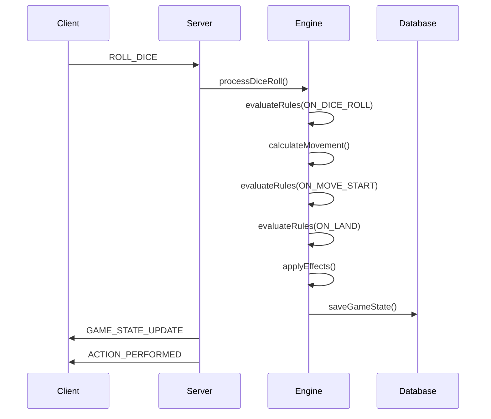
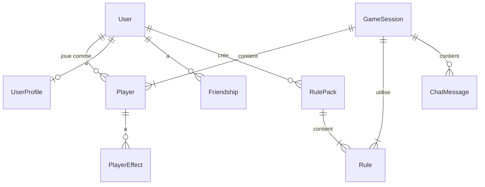

# Architecture Système - SHIFT

> Version: 1.0.0
> Dernière mise à jour: 2026-02-04

## Vue d'Ensemble



## Architecture Client

### Flux de Données



### Composants Principaux

| Composant | Responsabilité | Fichier |
|-----------|----------------|---------|
| ShiftGame | Orchestration du jeu | `components/shift-game.tsx` |
| GameViewport | Rendu du plateau | `components/game/game-viewport.tsx` |
| RuleBuilderModal | Création de règles | `components/game/rule-builder-modal.tsx` |
| ActionHistory | Historique des actions | `components/game/action-history.tsx` |
| ChatPanel | Chat en jeu | `components/game/chat-panel.tsx` |

### Hooks Critiques

| Hook | Fonction | Dépendances |
|------|----------|-------------|
| useGameState | État global du jeu | GameContext |
| useGameControls | Contrôles joueur | useGameState, Socket |
| useRuleManagement | CRUD règles | useGameState, Socket |
| useTurnManagement | Gestion des tours | useGameState |
| useBotAI | Logique IA | useGameState |

### Contextes React

```typescript
// GameContext - État principal
interface GameContextValue {
  gameState: GameState | null;
  currentPlayer: Player | null;
  isMyTurn: boolean;
  dispatch: (action: GameAction) => void;
}

// AudioContext - Gestion audio
interface AudioContextValue {
  playSound: (sound: SoundType) => void;
  setVolume: (volume: number) => void;
  isMuted: boolean;
}
```

## Architecture Serveur

### Structure des Services



### Moteur de Jeu (Engine)

Le moteur de jeu est le cœur de la logique métier. Il est composé de modules découplés:

| Module | Fichier | Responsabilité |
|--------|---------|----------------|
| Processor | `engine/processor.ts` | Orchestration du flux de jeu |
| RuleEvaluator | `engine/rule-evaluator.ts` | Évaluation des conditions |
| EffectManager | `engine/effect-manager.ts` | Application des effets |
| ConditionEvaluator | `engine/condition-evaluator.ts` | Parsing des conditions |
| Actions | `engine/actions.ts` | Exécution des actions |

### Flux d'un Tour



## Modèle de Données

### Entités Principales



### Schéma Prisma Simplifié

```prisma
model User {
  id        String   @id @default(uuid())
  username  String   @unique
  avatar    Json
  profile   UserProfile?
  players   Player[]
  rulePacks RulePack[]
}

model GameSession {
  id          String   @id @default(uuid())
  status      GameStatus
  hostId      String
  boardSize   Int
  players     Player[]
  rules       Rule[]
  currentTurn Int
}

model Player {
  id        String   @id @default(uuid())
  position  Int
  score     Int
  color     PlayerColor
  effects   Json
  userId    String?
  gameId    String
}

model Rule {
  id        String   @id @default(uuid())
  name      String
  trigger   RuleTrigger
  condition Json?
  effect    Json
  isActive  Boolean
}
```

## Communication Temps Réel

### Événements Socket.io

#### Client → Serveur
| Événement | Payload | Description |
|-----------|---------|-------------|
| `join_game` | `{ gameId, userId }` | Rejoindre une partie |
| `roll_dice` | `{ gameId }` | Lancer le dé |
| `create_rule` | `{ gameId, rule }` | Créer une règle |
| `send_message` | `{ gameId, message }` | Envoyer un message |

#### Serveur → Client
| Événement | Payload | Description |
|-----------|---------|-------------|
| `game_state` | `GameState` | État complet du jeu |
| `player_moved` | `{ playerId, from, to }` | Mouvement d'un joueur |
| `rule_triggered` | `{ rule, effects }` | Règle déclenchée |
| `turn_changed` | `{ playerId }` | Changement de tour |

## Sécurité

### Validation des Actions

Toutes les actions joueur sont validées côté serveur:

```typescript
// Exemple de validation
function validateRollDice(gameId: string, userId: string): boolean {
  const game = getGame(gameId);
  const player = game.players.find(p => p.userId === userId);

  return (
    game.status === 'IN_PROGRESS' &&
    player !== undefined &&
    game.currentPlayerIndex === player.index &&
    !player.hasRolled
  );
}
```

### Protection Anti-Triche

- Génération du dé côté serveur uniquement
- Validation de tous les mouvements
- Vérification des conditions de règles
- Rate limiting sur les actions

## Scalabilité

### Stratégie de Cache

- État de jeu en mémoire pendant la partie
- Persistance périodique en base
- Redis potentiel pour multi-instance

### Points d'Extension

1. **Nouveaux Triggers**: Ajouter dans `RuleTrigger` enum
2. **Nouveaux Effets**: Implémenter dans `EffectManager`
3. **Modes de Jeu**: Créer nouveaux handlers dans `Processor`
